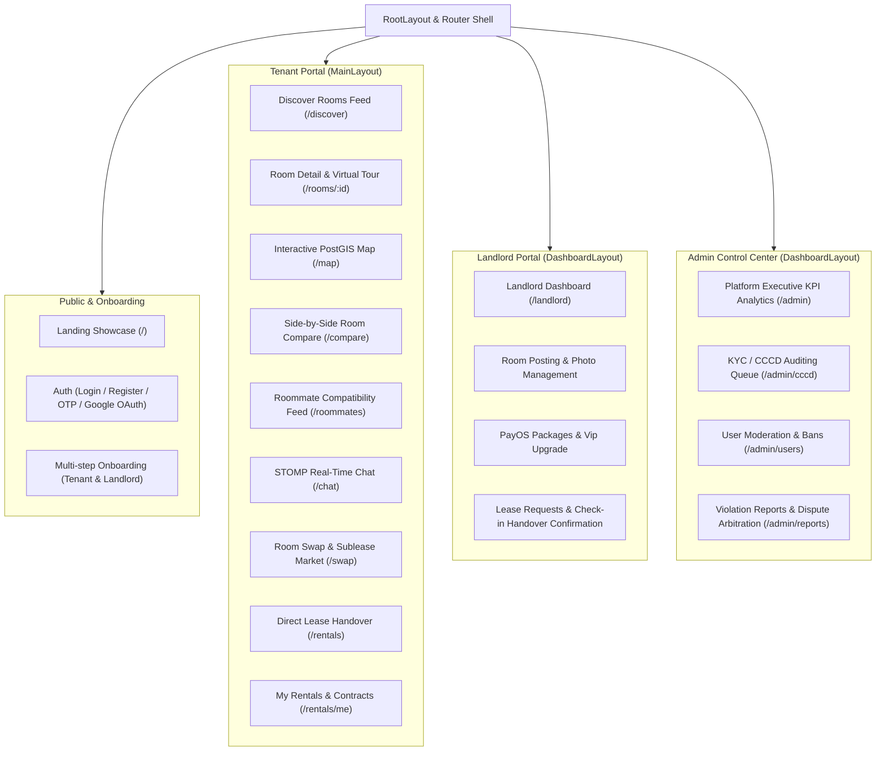

<p align="right">
  <a href="README.md"><b>English</b></a> | <a href="README.vi.md"><b>Tiếng Việt</b></a>
</p>

# PhongTrọXanh.vn — Frontend Web Application

> **Modern, High-Performance Single Page Application (SPA)** for smart rental housing discovery and roommate compatibility matching with real-time STOMP messaging, interactive PostGIS Leaflet map view, PayOS VietQR payments, and role-based administrative portals.

Seamlessly integrated with the [PhongTroXanh Backend Modular Monolith](https://github.com/TruongHai-SE/phongtroxanh-backend).

---

## Tech Stack

<p align="center">
  <a href="https://react.dev/"></a>
  <a href="https://www.typescriptlang.org/"></a>
  <a href="https://vite.dev/"></a>
  <a href="https://reactrouter.com/"></a>
  <a href="https://tailwindcss.com/"></a>
</p>

<p align="center">
  <a href="https://ui.shadcn.com/"></a>
  <a href="https://www.radix-ui.com/"></a>
  <a href="https://leafletjs.com/"></a>
  <a href="https://motion.dev/"></a>
  <a href="https://recharts.org/"></a>
</p>

<p align="center">
  <a href="https://payos.vn/"></a>
  <a href="https://threejs.org/"></a>
  <a href="https://lucide.dev/"></a>
  <a href="https://sonner.emilkowal.ski/"></a>
</p>

---

## 1. Technical Overview & Architecture Decisions

| Aspect | Architectural Choice | Engineering Rationale |
| :--- | :--- | :--- |
| **Frontend Framework** | **React 18 + Vite 6 (SPA)** | Instant Hot Module Replacement (HMR), tree-shaking, and predictable component lifecycle for rich client-side interactivity without SSR server overhead. |
| **Component Architecture** | **Domain-Driven Feature Slices** | Organized into 15 isolated business features (`features/*`) with co-located components, pages, services, and types; preventing tight coupling and spaghettified codebases. |
| **Styling & Design System** | **Tailwind CSS v4 + Radix UI + shadcn/ui** | Zero-runtime CSS with modern design tokens, full dark/light palette harmony, mobile-first responsive breakpoints, and fully accessible WAI-ARIA primitive compliance. |
| **State & Data Fetching** | **Custom API Client + JWT Interceptors** | Lightweight Axios-style typed wrapper (`api.ts`) managing automatic Bearer token injection, proactive token refresh rotation, and unified `ApiResponse<T>` error unbundling. |
| **Spatial Map Experience** | **Leaflet + React-Leaflet** | Lightweight client-side geospatial map rendering custom room pins, clustering, dynamic radius circles, and syncing bounding-box coordinates with backend PostGIS queries. |
| **Real-time Synchronization** | **STOMP over WebSocket + Fallback Polling** | Full-duplex instant chat message dispatching (`/ws/chat`), real-time typing indicators, read receipts, and online presence status (`🟢 Trực tuyến`) with automatic reconnect. |
| **Gesture & Micro-Interactions** | **Motion (Framer Motion v12)** | Physics-based spring animations for Tinder-style roommate cards, smooth page transitions, interactive swipe gestures, and celebratory confetti upon mutual matches. |
| **Payment Integration** | **PayOS VietQR Gateway** | Seamless banking checkout experience: dynamic QR modal, live countdown timer, and automatic polling/callback redirect to verify invoice completion. |

---

## 2. System Navigation & Role-Based Portals



---

## 3. Directory Structure

```
frontend/src/
├── app/                                 # Global application shell & routing
│   ├── App.tsx                          # Root provider wrapper (Theme, Toast, Auth)
│   ├── main.tsx                         # Vite application entrypoint
│   └── router.tsx                       # React Router 7 declarative route tree
├── components/                          # Shared UI components and layouts
│   ├── layouts/                         # RootLayout, MainLayout, DashboardLayout
│   └── ui/                              # 30+ atomic shadcn/radix primitives (Button, Dialog, Card...)
├── features/                            # 15 Domain-driven feature modules
│   ├── account/                         # Profile editing, account settings, avatar upload
│   ├── admin/                           # Executive KPI charts, KYC audit queue, report arbitration
│   ├── auth/                            # Landing, Login, Onboarding, OTP verification, Google OAuth
│   ├── chat/                            # WebSocket STOMP messaging, conversation list, online status
│   ├── landlord/                        # Landlord property management, listing boost, subscriptions
│   ├── locations/                       # Vietnamese address picker & Goong autocomplete
│   ├── misc/                            # Error pages (404, 500, Offline, Access Denied), About
│   ├── monetization/                    # Tiered packages catalog, PayOS VietQR modal, Callback
│   ├── notifications/                   # Notification center & read state
│   ├── rentals/                         # Active lease management & handover check-in confirmation
│   ├── reports/                         # Violation reporting dialog & evidence upload
│   ├── reviews/                         # Two-way rating submission & TrustScore visualization
│   ├── roommates/                       # Roommate compatibility feed, swipe deck, mutual match dialog
│   ├── rooms/                           # Discover grid, PostGIS Leaflet map view, room comparison
│   └── swaps/                           # Room swap proposals and lease transfer listings
├── hooks/                               # Custom reusable React hooks (useAuth, useDebounce...)
├── lib/                                 # Core infrastructure libraries
│   ├── api.ts                           # Unified Axios/Fetch API wrapper with JWT interceptor
│   ├── constants.ts                     # Vietnamese districts, amenities, pricing constants
│   └── utils.ts                         # Tailwind cn() merger, currency formatters, date utilities
└── types/                               # TypeScript domain entities and API DTO contracts
```

---

## 4. Key User Experience (UX) Highlights

### 4.1. Tinder-Style Roommate & Room Matching
- **Interactive Card Deck:** Implemented via Framer Motion with fluid drag physics, rotation tilt, and instant feedback indicators (*LIKE*, *PASS*, *SUPER LIKE*).
- **8-Pillar Compatibility Breakdown:** Displays direct percentage affinity for sleep habits, cleanliness, noise tolerance, and budget overlap.
- **Celebratory Mutual Match:** Fires confetti animations (`canvas-confetti`) when both users swipe right, providing a direct shortcut to open an encrypted chat room.

### 4.2. Interactive PostGIS Map View (`/map`)
- Custom SVG map markers color-coded by price bracket.
- Radius search circle centered on major universities (ĐHQG, Bách Khoa, FPT University, etc.) or user's live geolocation.
- Synchronized double-binding: Panning or zooming the map automatically queries backend PostGIS bounding box endpoints (`/api/v1/rooms/map`).

### 4.3. Real-Time STOMP WebSocket Chat (`/chat`)
- Direct bidirectional message delivery without page reloads.
- Online presence indicator: Displays `🟢 Trực tuyến` when active on WebSocket, with a seamless fallback to short-polling when WebSocket is disconnected.
- Unread message counters, image attachments, and landlord-tenant negotiation context cards.

### 4.4. PayOS VietQR Instant Checkout
- Integrated PayOS checkout modal with real-time dynamic QR code generation.
- 5-minute countdown timer with banking transaction description copy-to-clipboard.
- Automated payment callback verification (`/payment/callback`) activating landlord VIP perks instantly.

---

## 5. Local Setup & Getting Started

### Prerequisites
* **Node.js:** v20 LTS or newer.
* **Package Manager:** `npm`, `pnpm` (recommended), or `yarn`.
* **Backend Service:** Running instance of [PhongTroXanh Backend](https://github.com/TruongHai-SE/phongtroxanh-backend) on port `8080`.

### Step 1: Install Dependencies
```bash
npm install
# or
pnpm install
```

### Step 2: Configure Environment Variables
Copy the example environment template:
```bash
cp .env.example .env
```
Populate configuration keys:
```env
# Backend REST API Base URL
VITE_API_BASE_URL=http://localhost:8080/api/v1

# Backend WebSocket STOMP Endpoint
VITE_WS_URL=http://localhost:8080/ws/chat

# Optional: Google Maps / Goong API key for address lookup
VITE_GOONG_API_KEY=your_goong_api_key
```

### Step 3: Start Development Server
```bash
npm run dev
# or
pnpm dev
```
The application will launch at `http://localhost:5173`.

### Step 4: Production Build & Preview
Validate TypeScript compilation and create optimized distribution bundle:
```bash
npm run build
npm run preview
```
Production assets are generated into `/dist` with Gzip/Brotli compression readiness.

---

## 6. Integration & Compatibility Guide

| Backend Service | Protocol | Frontend Integration Point |
| :--- | :---: | :--- |
| **RESTful API** | HTTP/1.1 JSON | `src/lib/api.ts` (Bearer JWT, Auto Error Toast) |
| **Chat & Status** | STOMP / WebSocket | `src/features/chat/services/chatSocket.ts` |
| **PostGIS Spatial** | GeoJSON / Coordinates | `src/features/rooms/pages/MapView.tsx` (Leaflet) |
| **PayOS Gateway** | Webhook / Redirect URL | `src/features/monetization/pages/PaymentCallback.tsx` |
| **Cloudinary Media** | HTTPS Multipart | Direct upload & CDN asset rendering |

---

## 7. License & Credits

Developed by **TruongHai-SE** as part of the **PhongTroXanh.vn** Smart Green Housing Ecosystem.
Licensed under the [MIT License](LICENSE).