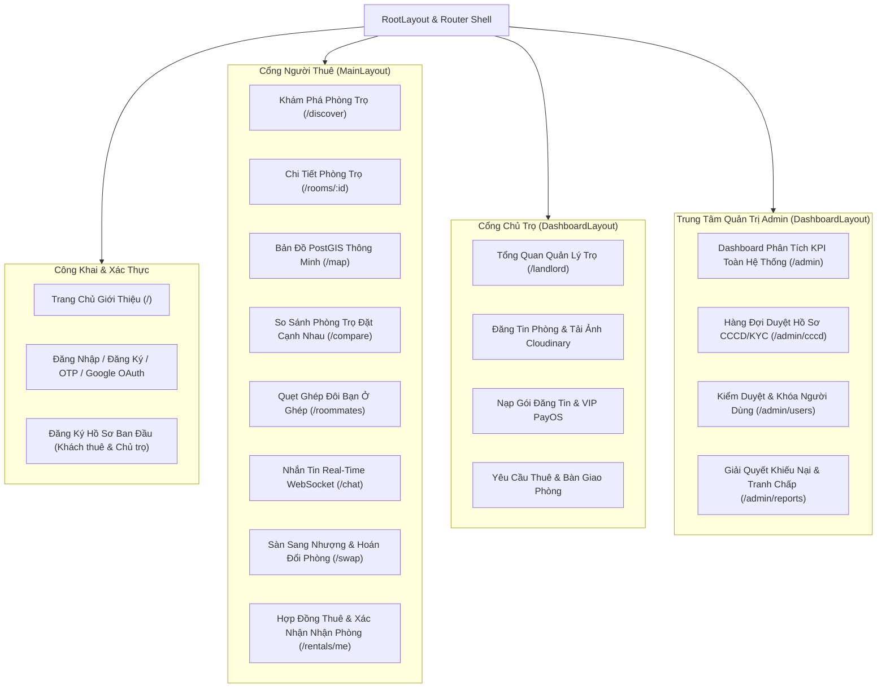

<p align="right">
  <a href="README.md"><b>English</b></a> | <a href="README.vi.md"><b>Tiếng Việt</b></a>
</p>

# PhongTrọXanh.vn — Frontend Web Application

> **Ứng dụng Single Page Application (SPA) hiện đại, hiệu năng cao** phục vụ tìm kiếm phòng trọ thông minh, ghép đôi bạn ở ghép (Roommate Matching), nhắn tin thời gian thực qua STOMP WebSocket, bản đồ tương tác PostGIS Leaflet, thanh toán VietQR tự động qua PayOS và các cổng quản trị phân quyền đa vai trò.

Tích hợp đồng bộ toàn diện với [PhongTroXanh Backend Modular Monolith](https://github.com/TruongHai-SE/phongtroxanh-backend).

---

## Tech Stack (Công Nghệ Sử Dụng)

<p align="center">
  <a href="https://react.dev/"></a>
  <a href="https://www.typescriptlang.org/"></a>
  <a href="https://vite.dev/"></a>
  <a href="https://reactrouter.com/"></a>
  <a href="https://tailwindcss.com/"></a>
</p>

<p align="center">
  <a href="https://ui.shadcn.com/"></a>
  <a href="https://www.radix-ui.com/"></a>
  <a href="https://leafletjs.com/"></a>
  <a href="https://motion.dev/"></a>
  <a href="https://recharts.org/"></a>
</p>

<p align="center">
  <a href="https://payos.vn/"></a>
  <a href="https://threejs.org/"></a>
  <a href="https://lucide.dev/"></a>
  <a href="https://sonner.emilkowal.ski/"></a>
</p>

---

## 1. Tổng Quan Kỹ Thuật & Quyết Định Kiến Trúc

| Hạng mục | Công nghệ lựa chọn | Giải trình kỹ thuật |
| :--- | :--- | :--- |
| **Framework nền tảng** | **React 18 + Vite 6 (SPA)** | Tận dụng Hot Module Replacement (HMR) cực nhanh, tối ưu hóa bundle size và đảm bảo trải nghiệm người dùng liền mạch không cần reload trang. |
| **Kiến trúc mã nguồn** | **Domain-Driven Feature Slices** | Chia dự án thành 15 tính năng nghiệp vụ độc lập (`features/*`). Mỗi thư mục tự chứa Components, Pages, Services và Types riêng, loại bỏ phụ thuộc chéo rối rắm. |
| **Giao diện & Design System** | **Tailwind CSS v4 + Radix UI + shadcn/ui** | Biên dịch CSS zero-runtime, hệ thống design tokens hiện đại, chuẩn tiếp cận WAI-ARIA và thích ứng hoàn hảo giữa Mobile và Desktop (Responsive). |
| **Quản lý State & Gọi API** | **Custom API Client + JWT Interceptors** | Lớp bọc gọi API hướng đối tượng (`api.ts`), tự động đính kèm `Bearer Token`, tự động xử lý mã lỗi và cơ chế refresh token ngầm khi AccessToken hết hạn. |
| **Bản đồ không gian** | **Leaflet + React-Leaflet** | Bản đồ tương tác mượt mà, ghim phòng trọ tùy biến theo mức giá, vẽ vòng tròn bán kính và đồng bộ tọa độ khung nhìn (bounding box) với PostGIS của backend. |
| **Giao tiếp Realtime** | **STOMP over WebSocket + Polling dự phòng** | Trao đổi tin nhắn tức thời qua socket `/ws/chat`, hiển thị trạng thái `🟢 Trực tuyến`, tự động kết nối lại khi mất mạng và có polling dự phòng. |
| **Hiệu ứng & Cử chỉ** | **Motion (Framer Motion v12)** | Cử chỉ vuốt thẻ tìm bạn cùng phòng phong cách Tinder, hiệu ứng chuyển trang mượt mà và pháo hoa ăn mừng khi ghép đôi thành công (`canvas-confetti`). |
| **Cổng thanh toán** | **PayOS VietQR Tự Động** | Trải nghiệm quét mã ngân hàng tiện lợi: popup mã QR động, đồng hồ đếm ngược 5 phút và tự động kích hoạt gói VIP ngay khi chuyển khoản xong. |

---

## 2. Luồng Điều Hướng & Các Phân Hệ Người Dùng



---

## 3. Cấu Trúc Thư Mục Dự Án

```
frontend/src/
├── app/                                 # Vỏ bọc toàn cục và khai báo Route
│   ├── App.tsx                          # Root provider (Theme, Toast, Auth)
│   ├── main.tsx                         # Entry point của Vite
│   └── router.tsx                       # Cấu hình 30+ routes React Router 7
├── components/                          # Các thành phần UI dùng chung
│   ├── layouts/                         # RootLayout, MainLayout, DashboardLayout
│   └── ui/                              # 30+ atomic components chuẩn shadcn (Button, Dialog, Card...)
├── features/                            # 15 Module tính năng nghiệp vụ
│   ├── account/                         # Quản lý tài khoản cá nhân, chỉnh sửa hồ sơ
│   ├── admin/                           # Biểu đồ KPI, hàng đợi duyệt CCCD/KYC, xử lý báo cáo
│   ├── auth/                            # Đăng nhập, đăng ký, OTP, Google OAuth2
│   ├── chat/                            # Nhắn tin realtime WebSocket STOMP, danh sách hội thoại
│   ├── landlord/                        # Dashboard chủ trọ, quản lý danh sách phòng, nâng cấp VIP
│   ├── locations/                       # Chọn quận/huyện, phường/xã và gợi ý địa chỉ
│   ├── misc/                            # Trang lỗi (404, 500, Offline, Access Denied), Giới thiệu
│   ├── monetization/                    # Bảng giá gói, modal thanh toán PayOS VietQR, Callback
│   ├── notifications/                   # Trung tâm thông báo hệ thống
│   ├── rentals/                         # Hợp đồng thuê nhà và xác nhận bàn giao nhận phòng
│   ├── reports/                         # Form gửi báo cáo vi phạm phòng/người dùng
│   ├── reviews/                         # Đánh giá 2 chiều và hiển thị điểm tín nhiệm TrustScore
│   ├── roommates/                       # Quẹt thẻ tìm bạn cùng phòng, độ hòa hợp 8 tiêu chí
│   ├── rooms/                           # Lưới phòng trọ, bản đồ Leaflet PostGIS, so sánh phòng
│   └── swaps/                           # Sàn sang nhượng hợp đồng thuê và hoán đổi phòng
├── hooks/                               # Các React hooks tiện ích (useAuth, useDebounce...)
├── lib/                                 # Thư viện hạ tầng lõi
│   ├── api.ts                           # Client HTTP đóng gói kèm bộ chặn JWT
│   ├── constants.ts                     # Danh mục quận huyện, tiện ích, hằng số hệ thống
│   └── utils.ts                         # Hàm tiện ích cn(), định dạng tiền tệ VNĐ, ngày tháng
└── types/                               # Định nghĩa TypeScript khớp 100% với DTO Backend
```

---

## 4. Điểm Nhấn Trải Nghiệm Người Dùng (UX)

### 4.1. Quẹt Thẻ Ghép Đôi Bạn Cùng Phòng (Tinder-Style)
- **Tập thẻ vuốt mượt mà:** Xây dựng bằng Framer Motion, mô phỏng lực kéo vật lý, góc nghiêng tự nhiên và phản hồi tức thì (*THÍCH*, *BỎ QUA*, *SIÊU THÍCH*).
- **Phân tích độ hòa hợp 8 tiêu chí:** Thể hiện trực quan tỷ lệ % tương thích về giờ giấc sinh hoạt, mức độ sạch sẽ, khả năng tài chính và quy định phòng.
- **Ghép đôi thành công (Mutual Match):** Khi hai bên cùng thích nhau, hệ thống kích hoạt hiệu ứng pháo hoa rực rỡ (`canvas-confetti`) và mở ngay lối tắt vào phòng chat riêng.

### 4.2. Bản Đồ Tìm Phòng Thông Minh (/map)
- Ghim phòng trọ tùy biến màu sắc theo phân khúc giá tiền.
- Vẽ vòng tròn bán kính tìm kiếm quanh các trường đại học lớn (ĐHQG TP.HCM, Bách Khoa, FPT University...).
- Đồng bộ 2 chiều: Khi di chuyển hoặc phóng to/thu nhỏ bản đồ, frontend tự động gửi tọa độ khung nhìn về PostGIS Backend (`/api/v1/rooms/map`) để lấy dữ liệu phòng mới.

### 4.3. Nhắn Tin Thời Gian Thực (/chat)
- Gửi nhận tin nhắn ngay lập tức qua WebSocket không giật lag.
- Huy hiệu trạng thái kết nối: Hiển thị `🟢 Trực tuyến` khi đang nối STOMP Socket, tự động chuyển về chế độ tự cập nhật khi mất kết nối mạng.
- Đếm số tin nhắn chưa đọc và hiển thị thẻ thông tin phòng trọ đang trao đổi trực tiếp trong khung chat.

### 4.4. Thanh Toán Nhanh VietQR PayOS
- Modal thanh toán hiển thị mã VietQR động được tạo tự động từ PayOS.
- Đồng hồ đếm ngược 5 phút, nút sao chép nhanh số tài khoản và cú pháp chuyển khoản.
- Tự động bắt webhook xác thực và chuyển hướng trang thành công (`/payment/callback`) để nâng cấp quyền lợi chủ trọ ngay lập tức.

---

## 5. Hướng Dẫn Cài Đặt & Khởi Chạy Local

### Yêu Cầu Môi Trường
* **Node.js:** Phiên bản 20 LTS trở lên.
* **Trình quản lý gói:** `npm`, `pnpm` (khuyên dùng), hoặc `yarn`.
* **Backend:** Khởi chạy sẵn [PhongTroXanh Backend](https://github.com/TruongHai-SE/phongtroxanh-backend) tại cổng `8080`.

### Bước 1: Cài đặt các gói phụ thuộc
```bash
npm install
# hoặc
pnpm install
```

### Bước 2: Thiết lập biến môi trường
Tạo file `.env` từ file mẫu:
```bash
cp .env.example .env
```
Điền các giá trị kết nối:
```env
# Địa chỉ gốc của Backend REST API
VITE_API_BASE_URL=http://localhost:8080/api/v1

# Địa chỉ kết nối WebSocket STOMP
VITE_WS_URL=http://localhost:8080/ws/chat

# (Tùy chọn) Khóa API Goong Maps hoặc Google Maps
VITE_GOONG_API_KEY=your_goong_api_key
```

### Bước 3: Khởi chạy môi trường phát triển (Dev Server)
```bash
npm run dev
# hoặc
pnpm dev
```
Truy cập ứng dụng tại: `http://localhost:5173`.

### Bước 4: Đóng gói bản Production
Kiểm tra biên dịch TypeScript và tối ưu hóa file đóng gói:
```bash
npm run build
npm run preview
```
Thư mục `/dist` được sinh ra sẵn sàng để deploy lên Vercel, Netlify hoặc Cloudflare Pages.

---

## 6. Bảng Ánh Xạ Tích Hợp Frontend — Backend

| Dịch vụ Backend | Giao thức | Điểm tích hợp trên Frontend |
| :--- | :---: | :--- |
| **RESTful API Core** | HTTP/1.1 JSON | `src/lib/api.ts` (Tự động gắn Bearer Token) |
| **Nhắn tin & Trạng thái** | STOMP / WebSocket | `src/features/chat/services/chatSocket.ts` |
| **Bản đồ không gian** | GeoJSON / Coordinates | `src/features/rooms/pages/MapView.tsx` (Leaflet) |
| **Cổng thanh toán VietQR** | Webhook / Redirect | `src/features/monetization/pages/PaymentCallback.tsx` |
| **Lưu trữ ảnh Cloudinary** | HTTPS Multipart | Upload trực tiếp và hiển thị tối ưu CDN |

---

## 7. Bản Quyền & Tác Giả

Dự án được xây dựng và phát triển bởi **TruongHai-SE** trong khuôn khổ Hệ sinh thái Nhà trọ xanh thông minh **PhongTroXanh.vn**.
Giấy phép phát hành: [MIT License](LICENSE).
